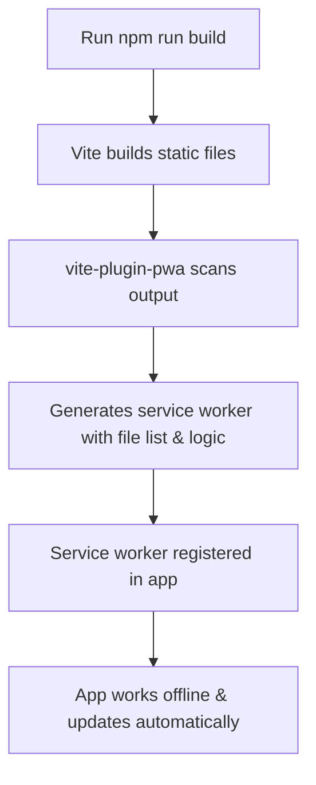

# Sakai Vue App – Progressive Web App (PWA) Conversion

---

## 📋 Project Overview

Sakai Vue is a modern, responsive dashboard application built with Vue.js and Vite. This project has been **converted into a Progressive Web App (PWA)**, making it installable, offline-capable, and providing an app-like experience on desktop and mobile devices.

---

## 🌐 What is a Progressive Web App (PWA)?

A PWA is a web application that uses modern browser features to deliver a native app-like experience. Key benefits include:

-   **Installability:** Users can add the app to their home screen or desktop.
-   **Offline Support:** The app works without an internet connection.
-   **Native Experience:** Standalone window, custom icon, and splash screen.
-   **Performance:** Faster load times via caching.

---

## 🚀 What Was Delivered

-   The Sakai Vue app is now a fully functional PWA.
-   Users can install the app on desktop or mobile and use it offline.
-   The PWA setup is robust, using industry best practices and automated tooling.

---

## ⚙️ How PWA Works in This Project

### Service Worker Generation & Caching

The PWA functionality is powered by the [`vite-plugin-pwa`](https://vite-pwa-org.netlify.app/) plugin, which automates the creation and management of the service worker and manifest.

#### How the Service Worker is Generated

1. **Development:**
    - A basic service worker is provided for installability.
2. **Production Build:**
    - When you run `npm run build`, Vite outputs all static files.
    - The plugin scans the output, finds all files to cache, and generates a service worker with:
        - The list of files to cache (with hashed names)
        - Caching and update logic
    - The service worker is automatically registered in your app.

#### Diagram: Service Worker Generation



#### Why Not a Static Service Worker?

-   A static service worker in `public/` cannot track file changes or hashed filenames after each build.
-   The plugin ensures the service worker is always up-to-date and reliable.

---

## 📝 Code Changes Explained

To enable PWA features, the following changes were made:

1. **PWA Dependency Installed**
    - Added `vite-plugin-pwa` as a dev dependency:
        ```bash
        npm install vite-plugin-pwa --save-dev
        ```
2. **Manifest Configuration**
    - Created `public/manifest.json` (for development and fallback):
        ```json
        {
            "name": "Sakai Vue App",
            "short_name": "Sakai",
            "description": "A modern Vue.js dashboard app.",
            "start_url": ".",
            "display": "standalone",
            "background_color": "#ffffff",
            "theme_color": "#0d6efd",
            "icons": [
                { "src": "/demo/images/logo.svg", "sizes": "192x192", "type": "image/svg+xml" },
                { "src": "/demo/images/logo.svg", "sizes": "512x512", "type": "image/svg+xml" }
            ]
        }
        ```
    - Also configured the manifest in `vite.config.mjs` for production builds (plugin-managed):
        ```js
        import { VitePWA } from 'vite-plugin-pwa';
        // ...
        plugins: [
            // ...
            VitePWA({
                registerType: 'autoUpdate',
                manifest: {
                    name: 'Sakai Vue App',
                    short_name: 'Sakai',
                    description: 'A modern Vue.js dashboard app.',
                    start_url: '.',
                    display: 'standalone',
                    background_color: '#ffffff',
                    theme_color: '#0d6efd',
                    icons: [
                        { src: '/demo/images/logo.svg', sizes: '192x192', type: 'image/svg+xml' },
                        { src: '/demo/images/logo.svg', sizes: '512x512', type: 'image/svg+xml' }
                    ]
                }
            })
        ];
        ```
3. **HTML Head Update**
    - Added manifest and theme color to `index.html`:
        ```html
        <link rel="manifest" href="/manifest.json" /> <meta name="theme-color" content="#0d6efd" />
        ```

---

## 🛠️ How to Use and Test the PWA

1. **Install dependencies:**
    ```bash
    npm install
    ```
2. **Run in development:**
    ```bash
    npm run dev
    ```
    Open [http://localhost:5173](http://localhost:5173) in your browser.
3. **Build for production:**
    ```bash
    npm run build
    npm run preview
    ```
4. **Test PWA features:**
    - Open the app in Chrome, Edge, or another PWA-supporting browser.
    - Look for the install prompt in the address bar or browser menu.
    - Click to install the app to your desktop or mobile device.
    - The app will work offline after the first load.

---

## 📦 Dependencies

-   [`vite-plugin-pwa`](https://vite-pwa-org.netlify.app/) – Handles service worker and manifest generation for Vite projects.

---

## 🗂️ Project Structure (Key Files)

```
src/                # Vue components, views, and layout
public/manifest.json # Web app manifest for PWA
public/demo/images/  # App icons and images
vite.config.mjs      # Vite configuration with PWA plugin
index.html           # HTML entry point
```

---

## ❓ Why Both manifest.json and vite.config.mjs Manifest Config?

-   `public/manifest.json` is used for development and as a fallback.
-   The manifest in `vite.config.mjs` is used by the plugin to generate a production-ready manifest and ensure it matches the service worker.
-   This approach guarantees your PWA is always up-to-date and reliable.

| File/Config                | Used For                | When Used        | Who Uses It     |
| -------------------------- | ----------------------- | ---------------- | --------------- |
| `public/manifest.json`     | Static manifest         | Dev & fallback   | Browser         |
| `vite.config.mjs` manifest | Dynamic, plugin-managed | Build/Production | Vite PWA plugin |

---

## 📢  Message d'Information

**How to use and test the delivered PWA feature:**

-   The application is now installable as a PWA. To test:
    1. Run `npm run dev` (for development) or `npm run preview` (for production build preview).
    2. Open the app in a browser like Chrome or Edge.
    3. You should see an install prompt in the address bar or browser menu.
    4. Click to install the app to your desktop or mobile device.
    5. The app will work offline after the first load.


## 📄 License

This project is licensed under the MIT License. See [LICENSE.md](LICENSE.md) for details.

---

## 🙏 Acknowledgements

-   [Vue.js](https://vuejs.org/)
-   [Vite](https://vitejs.dev/)
-   [PrimeVue](https://www.primefaces.org/primevue/)
-   [vite-plugin-pwa](https://vite-pwa-org.netlify.app/)
